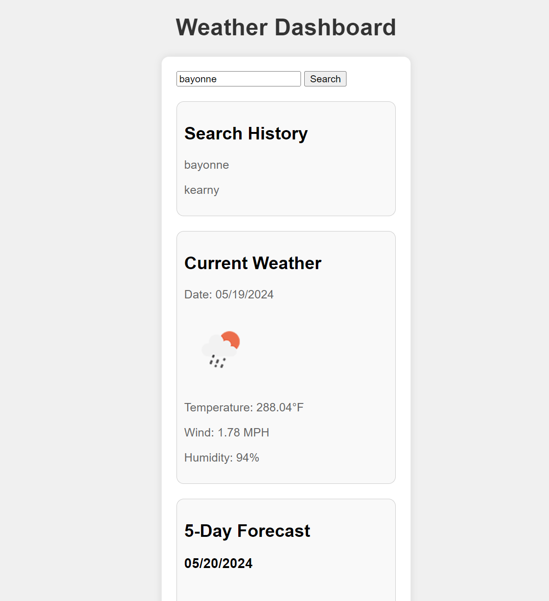

# <Your-Project-Title>

## Description

I created a weather application using the OpenWeather API. This project tells you the weather for cities and saves them. This project helped me learn how to use server-side APIs. 

## Table of Contents (Optional)

- [Installation](#installation)
- [Usage](#usage)
- [Credits](#credits)
- [License](#license)

## Installation

- Navigate to the website of my Github profile: https://github.com/mikorod622/Weather-Application
- Click the "<> Code" icon
- Click "Download ZIP"

## Usage

Search for the city you want and it will show the weather forecast and save it in the search history. Click the city in the search history to look at it's weather.

## Credits

https://openweathermap.org/forecast5#5days

## License

MIT License

Copyright (c) 2024 mikorod622

---

## Badges

Link to website: https://mikorod622.github.io/Weather-Application/